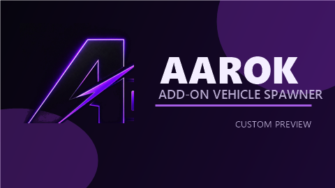

# AAROK Add-On Vehicle Spawner Theme

AAROK Add-On Vehicle Spawner Theme is a branded theme/config package for the GTA V Add-On Vehicle Spawner by ikt. It keeps the familiar spawner workflow while adding a cleaner purple AAROK visual identity, a custom default preview image, and safer defaults for testing modded vehicles in story mode.



## Features

- Purple AAROK menu theme.
- Internal menu title patched to `AAROK`.
- Custom default preview image using the AAROK logo mark.
- Top-left menu positioning.
- Safer test defaults:
  - official DLC listing disabled by default,
  - persistent vehicles disabled by default,
  - spawn-in-place disabled by default.

## Download

Use the release ZIP:

[AAROK-AddonSpawner-v1.6.5-theme-config.zip](release/AAROK-AddonSpawner-v1.6.5-theme-config.zip)

## Installation

1. Download the release ZIP.
2. Extract it.
3. Copy `AddonSpawner.asi` into your main GTA V folder.
4. Copy the `AddonSpawner` folder into your main GTA V folder.
5. Replace existing files if Windows asks.
6. Launch GTA V in story mode and press `F5`.

## Vehicle Test Groups

To group vehicles for testing:

1. Open `AddonSpawner/UserDLC`.
2. Create a `.list` file, for example `AAROK Tests.list`.
3. Add one vehicle spawn name per line.

Example:

```txt
nisgtr32
ae86
```

The group will appear in the spawner under user add-on groupings.

## Important Notes

- Use this only in GTA V story mode.
- Do not use modded files in GTA Online.
- This package is branded as `1.6.5` for the AAROK theme/config build.
- The core ASI remains based on Add-On Vehicle Spawner `1.6.2`.
- Real anti-crash/freeze fixes inside the ASI require source-code changes, compilation, and in-game testing.
- Add-On Vehicle Spawner / GTAVAddonLoader is licensed under MPL 2.0. Keep the original credits and source link when redistributing.

## Credits

- Original Add-On Vehicle Spawner: ikt.
- AAROK theme, configuration, and preview asset: AAROK.
